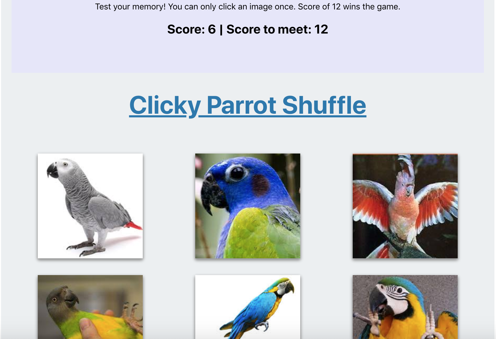
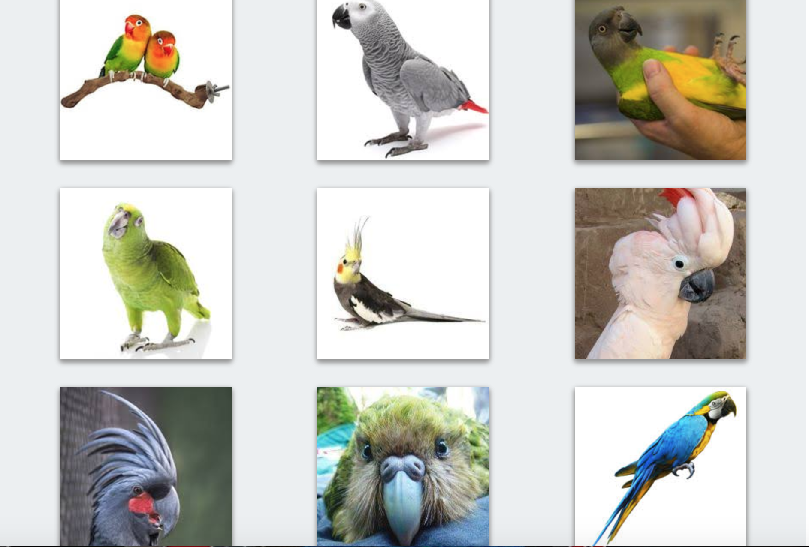

# React Clicky-Game

### Overview

Test your memory! Try the clicky parrot shuffle. This app features a React UI that makes use of components to manage component state and respond to user events, namely clicks! Built with React, Node.js, CSS, HTML. You can only click an image once. It's harder than you think. Score of 12 wins the game.

## React User Interface

The score is based on the number of clicks. If you click on an image more the once you lose.

## Parrot Grid

### Technologies Implemented

* React
* Node.js
* HTML
* CSS

### Live site

* deployed: https://lilysimmons.github.io/clicky-game/

### Learn More

This project was bootstrapped with [Create React App](https://github.com/facebook/create-react-app).

You can learn more in the [Create React App documentation](https://facebook.github.io/create-react-app/docs/getting-started).

To learn React, check out the [React documentation](https://reactjs.org/).

